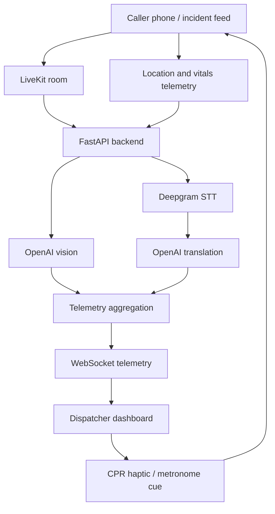

# D/SPATCH

**D/SPATCH** is a real-time emergency dispatch cockpit that helps 911 operators understand what is happening before responders arrive. Instead of relying only on a frantic voice call, dispatchers can view caller POV video, location, AI-suggested scene hazards, live transcript/translation, CPR guidance state, and unit/event activity in one dashboard.

> Built for hackathon demo speed: the project supports both a reliable mock mode and a live mode using LiveKit, OpenAI, and Deepgram.

## Why It Matters

Emergency calls are often chaotic. Callers may be panicked, injured, non-English speaking, unsure of their location, or unable to clearly describe the scene. D/SPATCH gives dispatchers a richer command view while keeping AI suggestions clearly labeled as decision support, not diagnosis.

The goal is social impact: faster situational awareness, better CPR coaching, better language accessibility, and safer responder preparation.

## Key Features

- **Live caller POV video** — The caller/camera feed gives dispatchers visual context beyond voice.
- **AI scene triage** — Vision analysis highlights observable hazards and patient cues such as posture, cyanosis hints, CPR/Narcan presence, and scene risks.
- **Hallucination mitigation** — Hazards are filtered by confidence and multi-frame confirmation before surfacing as scene safety signals.
- **Live transcription** — Deepgram converts caller/dispatcher audio into a timestamped transcript.
- **Translation support** — Non-English transcript chunks can be translated to English while preserving original text for review.
- **Caller location panel** — GPS and accuracy are shown directly on the map overlay when available.
- **CPR tempo guidance** — Dispatchers can send CPR metronome/haptic cues to the caller device.
- **Active unit and event log** — Dispatchers can track assigned units and timestamped actions such as dispatches, hazards, and CPR state changes.
- **Pipeline health separation** — System/service issues appear separately from on-scene hazards so operators do not confuse infrastructure alerts with camera safety alerts.
- **Mock and live modes** — Mock mode supports judging and demos without cloud API dependencies; live mode uses real media and AI services.

## Architecture



## Tech Stack

- **Frontend:** React, Vite, TypeScript, Tailwind CSS
- **Backend:** FastAPI, Python, Pydantic, WebSockets
- **Realtime media:** LiveKit
- **Speech-to-text:** Deepgram
- **AI:** OpenAI vision, summaries, and translation
- **Telemetry:** WebSocket event stream with typed dashboard payloads

## Repo Layout

```text
Metalink/
  frontend/          Dispatcher dashboard (React + Vite)
  backend/           FastAPI telemetry, AI, LiveKit, WebSocket service
  incident_feed/     Caller/bystander web flow and telemetry bridge
  ios/               Native experiments / mobile work
  dispatch/          Dispatch-related prototype assets
```

> Note: `frontend/` is the active React source tree. Some older build artifacts may exist elsewhere from previous iterations.

## Quick Start: Mock Demo

Mock mode is the safest way to demo the full UI without LiveKit/OpenAI/Deepgram credentials.

### 1. Start the backend

```bash
cd backend
python3 -m venv .venv
source .venv/bin/activate
pip install -r requirements.txt
cp .env.example .env
```

In `backend/.env`, set:

```env
MOCK_AI=true
ENABLE_INGESTION_LOOP=true
MOCK_TELEMETRY_SCENARIO=overdose_case
```

Run:

```bash
uvicorn app.main:app --reload --host 127.0.0.1 --port 8000
```

Useful backend URLs:

- `http://127.0.0.1:8000/api/health`
- `http://127.0.0.1:8000/api/telemetry/status`
- `http://127.0.0.1:8000/docs`

### 2. Start the dispatcher dashboard

From the repo root:

```bash
npm install --prefix frontend
npm run dev --prefix frontend
```

Open the Vite URL, usually:

```text
http://127.0.0.1:5173/
```

## Live Mode

Live mode connects the backend to actual caller media and cloud AI services.

In `backend/.env`, set:

```env
MOCK_AI=false
ENABLE_INGESTION_LOOP=true
LIVEKIT_URL=wss://...
LIVEKIT_API_KEY=...
LIVEKIT_API_SECRET=...
LIVEKIT_ROOM=...
OPENAI_API_KEY=...
DEEPGRAM_API_KEY=...
```

Then run the backend the same way:

```bash
cd backend
source .venv/bin/activate
uvicorn app.main:app --reload --host 127.0.0.1 --port 8000
```

For full backend setup, environment variables, WebSocket contract, and troubleshooting, see [`backend/README.md`](backend/README.md).

## Demo Flow 

1. Start backend and frontend.
2. Show the dispatcher dashboard connection state and session header.
3. Demonstrate the live/mock camera panel and map/location panel.
4. Point out AI-suggested hazards and the unconfirmed/acknowledge workflow.
5. Show live transcript and the collapsible AI summary.
6. Dispatch EMS/Police/Fire from the dispatch panel and show the event log.
7. Start CPR tempo guidance and explain caller-side haptic/metronome support.
8. Explain safety guardrails: camera heart rate is an estimate, AI is not diagnosis, and system alerts are separated from scene hazards.

## Important Safety Notes

- D/SPATCH is a **dispatcher decision-support prototype**, not a medical device.
- AI scene hazards are **suggestions** and should be verified by a human dispatcher.
- Camera-derived heart rate / rPPG is experimental and displayed as an estimate.
- Translation is intended to improve accessibility, but original text is preserved for review.
- Pipeline degradation is surfaced separately so system failures are not mistaken for real scene hazards.

## Testing and Smoke Checks

Backend:

```bash
cd backend
source .venv/bin/activate
python -m pytest tests/ -v
python -m compileall app -q
```

Frontend:

```bash
npm run build --prefix frontend
```

WebSocket path:

```text
ws://127.0.0.1:8000/api/ws/telemetry
```

More details:

- Backend guide: [`backend/README.md`](backend/README.md)
- Telemetry API contract: [`backend/docs/TELEMETRY_API.md`](backend/docs/TELEMETRY_API.md)
- Sample WebSocket payloads: [`backend/fixtures/websocket_event_samples.json`](backend/fixtures/websocket_event_samples.json)

## Troubleshooting

- **Dashboard offline:** ensure backend is running on `127.0.0.1:8000` and the frontend points to `/api/ws/telemetry`.
- **No live transcript:** make sure the caller is publishing audio to the LiveKit room and `DEEPGRAM_API_KEY` is set.
- **No vision updates:** make sure `MOCK_AI=false`, `OPENAI_API_KEY` is set, and the caller is publishing video.
- **Live ingestion unavailable:** usually means no audio/video reached the ingest loop, LiveKit credentials/room are wrong, or Deepgram timed out waiting for audio.
- **Want a reliable demo:** switch back to `MOCK_AI=true`.

## Team / Hackathon Notes

This repo was built as a multi-track hackathon project:

- Frontend dashboard and dispatcher UX
- Backend AI/telemetry pipeline
- Caller/incident feed
- CPR haptic/metronome flow
- Translation and accessibility improvements

D/SPATCH is designed to show how emergency dispatch can become more visual, multilingual, and actionable without removing the dispatcher from control.
