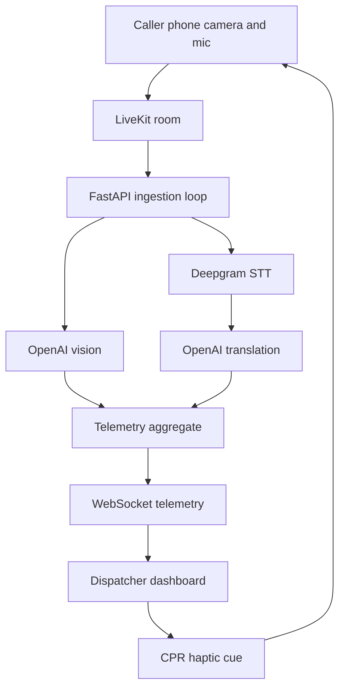

# D/SPATCH Backend

FastAPI backend for **D/SPATCH**, a real-time emergency dispatch cockpit that turns a caller's phone camera, microphone, location, and telemetry into dispatcher-ready situational awareness.

This service powers:

- Live caller video/audio ingestion through **LiveKit**
- Scene understanding with **OpenAI vision**
- Live transcription with **Deepgram**
- Translation-aware transcript aggregation
- Camera-derived emergency telemetry hints
- CPR haptic/metronome commands to caller devices
- Real-time dispatcher dashboard updates over WebSockets

> Hackathon note: run with `MOCK_AI=true` for a reliable no-API-key demo, or `MOCK_AI=false` for the live LiveKit/OpenAI/Deepgram pipeline.

## Summary

In emergencies, dispatchers usually rely on voice alone. D/SPATCH gives them a richer view: live caller POV, AI-suggested hazards, caller location, transcript/translation, CPR tempo cues, and pipeline health. The backend joins the same LiveKit room as the caller, processes video/audio, merges signals into one telemetry model, and broadcasts updates to the operator dashboard.



## Key Features

- **Live video/audio ingestion** — backend participant joins a LiveKit room and reads caller media streams.
- **AI scene triage** — OpenAI vision extracts observable cues such as hazards, patient posture, cyanosis, bystander action, and chest-rise visibility.
- **Hallucination mitigation** — low-confidence hazards are dropped and hazards must appear across multiple frames before reaching the dashboard.
- **Live transcription** — Deepgram converts caller/dispatcher audio into timestamped transcript segments.
- **Translation support** — non-English final transcript chunks can be translated to English while preserving original text for review.
- **Telemetry aggregation** — combines vision, transcript, CPR cues, location, haptic state, and pipeline status into one dashboard contract.
- **Dispatcher controls** — WebSocket messages can trigger rolling summaries, caller location refresh, and CPR metronome/haptic guidance.
- **Mock mode** — stable local demo path with no OpenAI, Deepgram, or LiveKit calls.
- **System health visibility** — degraded pipeline alerts are sent as system status, separate from scene hazards.

## Tech Stack

- **Python 3.11+**
- **FastAPI** + Uvicorn
- **Pydantic** telemetry schemas
- **LiveKit** for real-time media
- **OpenAI** for vision, summaries, and translation
- **Deepgram** for streaming speech-to-text
- **WebSockets** for dashboard telemetry

## Quickstart

Run all commands from the `backend/` directory.

```bash
cd backend
python3 -m venv .venv
source .venv/bin/activate
pip install -r requirements.txt
cp .env.example .env
```

For the easiest local demo, set these in `.env`:

```env
MOCK_AI=true
ENABLE_INGESTION_LOOP=true
```

Start the API:

```bash
uvicorn app.main:app --reload --host 127.0.0.1 --port 8000
```

Useful URLs:

- API base: `http://127.0.0.1:8000`
- OpenAPI docs: `http://127.0.0.1:8000/docs`
- Health check: `http://127.0.0.1:8000/api/health`
- Telemetry status: `http://127.0.0.1:8000/api/telemetry/status`

## Environment Variables

Copy `.env.example` to `.env` and fill in local values. Never commit `.env`.

| Variable | Required | Purpose |
| --- | --- | --- |
| `MOCK_AI` | yes | `true` uses deterministic mock telemetry; `false` enables live cloud services. |
| `ENABLE_INGESTION_LOOP` | yes | Starts the LiveKit/mock ingestion task on server startup. |
| `MOCK_TELEMETRY_SCENARIO` | no | Initial mock scenario, e.g. `overdose_case`, `normal_case`, `scene_hazard_case`, `degraded_pipeline_case`. |
| `CORS_ORIGINS` | no | Comma-separated frontend origins allowed to call the API. |
| `LIVEKIT_URL` | live mode | LiveKit cloud/server URL. |
| `LIVEKIT_API_KEY` | live mode | LiveKit API key. |
| `LIVEKIT_API_SECRET` | live mode | LiveKit API secret. |
| `LIVEKIT_ROOM` | live mode | Room the backend joins for caller media. |
| `OPENAI_API_KEY` | live mode | Enables vision, summaries, and translation. |
| `DEEPGRAM_API_KEY` | live mode | Enables live speech-to-text. |
| `DEEPGRAM_MODEL` | no | Deepgram model override; defaults are loaded from config. |
| `DEEPGRAM_LANGUAGE` | no | Language hint; `multi` is useful for demo translation flows. |
| `BACKEND_INTERNAL_URL` | integration | Used by adjacent Next.js/incident feed services when proxying to FastAPI. |

## Running Modes

### Mock Demo Mode

Use this for judging, UI demos, and development without cloud credentials:

```env
MOCK_AI=true
ENABLE_INGESTION_LOOP=true
MOCK_TELEMETRY_SCENARIO=overdose_case
```

Behavior:

- No OpenAI calls
- No Deepgram calls
- No LiveKit dependency required for telemetry
- WebSocket still emits production-shaped `telemetry.update` events

### Live Mode

Use this when a caller is publishing camera/mic to LiveKit:

```env
MOCK_AI=false
ENABLE_INGESTION_LOOP=true
LIVEKIT_URL=wss://...
LIVEKIT_API_KEY=...
LIVEKIT_API_SECRET=...
LIVEKIT_ROOM=...
OPENAI_API_KEY=...
DEEPGRAM_API_KEY=...
```

Start the backend after or shortly before the caller joins the room. If Deepgram receives no audio for its timeout window, the stream can close and the backend will retry the ingestion loop.

## API Endpoints

### Health and Status

```bash
curl -s http://127.0.0.1:8000/api/health
curl -s http://127.0.0.1:8000/api/telemetry/status
curl -s http://127.0.0.1:8000/api/telemetry/scenarios
```

### LiveKit Tokens

- Operator/dashboard subscriber token: `GET /api/livekit/token`
- Caller/bystander publisher token: `GET /api/livekit/broadcaster/token`

### Incident Telemetry

- Location + vitals ingestion: `POST /api/incident/telemetry`
- CPR haptic snapshot fallback: `GET /api/telemetry/haptic-snapshot`

Configure `BACKEND_INTERNAL_URL=http://127.0.0.1:8000` in `incident_feed/.env.local` so Next.js routes can proxy to FastAPI.

## WebSocket Telemetry

Dispatcher clients connect to:

```text
ws://127.0.0.1:8000/api/ws/telemetry
```

Optional mock scenario:

```text
ws://127.0.0.1:8000/api/ws/telemetry?scenario=overdose_case
```

Every message uses this v2 envelope:

```json
{
  "schema_version": "v2",
  "event_type": "telemetry.update",
  "timestamp": "2026-05-02T12:00:00.000000Z",
  "payload": {}
}
```

Common event types:

| Event | Meaning |
| --- | --- |
| `pipeline.status` | Initial connection state and mock/live mode. |
| `heartbeat` | Keeps WebSocket status fresh. |
| `telemetry.update` | Main dashboard payload: hazards, vitals, transcript, CPR cue, location, alerts. |
| `telemetry.summary_updated` | Rolling summary response after client requests one. |
| `client.pong` | Echo response for dashboard latency measurement. |

Client messages supported by the backend:

| Client event | Action |
| --- | --- |
| `client.ping` | Returns `client.pong` with the same timestamp. |
| `request.summary` | Generates a rolling transcript summary. |
| `request.caller_location` | Replays the latest caller location if available. |
| `dispatcher.cpr_guidance` | Broadcasts CPR haptic/metronome state to clients. |
| `request.dispatch_cpr` | Legacy CPR dispatch event, also maps to haptic cue. |

CLI test, if `websocat` is installed:

```bash
websocat ws://127.0.0.1:8000/api/ws/telemetry
```

Full frontend contract: `docs/TELEMETRY_API.md`  
Sample payloads: `fixtures/websocket_event_samples.json`

## Local Mic to Deepgram Test

This checks Deepgram and the local microphone without running the full FastAPI server.

Requirements:

- `DEEPGRAM_API_KEY` in `.env`
- `MOCK_AI=false`
- `sounddevice` and `numpy` installed from `requirements.txt`

```bash
cd backend
source .venv/bin/activate
export MOCK_AI=false
python -m scripts.mic_deepgram_stress_test
```

Expected output:

- `[interim]` transcript lines
- `[FINAL]` transcript lines
- Growing transcript buffer
- `STRESS_LEVEL: CRITICAL` after phrases such as "he's not breathing" or "oh my god help me"

Deepgram usage may bill your account unless covered by trial/free credit.

## Tests

```bash
source .venv/bin/activate
python -m pytest tests/ -v
python -m compileall app -q
```

Optional WebSocket soak test:

```bash
STABILITY_TEST=1 python -m pytest tests/test_smoke.py::test_websocket_five_minute_stability -v
```

## Project Layout

```text
backend/
  app/
    api/                 HTTP and WebSocket routes
    core/                Config, constants, mock telemetry, ingestion task wrapper
    schemas/             Pydantic WebSocket and telemetry contracts
    services/
      livekit_ingest.py       Joins LiveKit and reads audio/video tracks
      vision.py               OpenAI frame analysis
      transcription.py        Deepgram streaming STT
      translator.py           OpenAI transcript translation
      telemetry_aggregate.py  Merges vision, transcript, vitals, alerts
      broadcast.py            Converts service payloads to TelemetryUpdate events
  docs/                  Telemetry API docs
  fixtures/              Sample WebSocket events
  scripts/               Local development and test helpers
  tests/                 Backend tests
```

## Demo Script

1. Start backend in mock mode:
   ```bash
   cd backend
   source .venv/bin/activate
   uvicorn app.main:app --reload --host 127.0.0.1 --port 8000
   ```
2. Start the dispatcher frontend.
3. Show dashboard receiving WebSocket telemetry.
4. Toggle CPR guidance from the dashboard and point out the haptic cue state.
5. Switch to live mode if credentials and a caller room are ready.

## Troubleshooting

### Dashboard says telemetry is offline

- Make sure FastAPI is running on `127.0.0.1:8000`.
- Confirm the frontend WebSocket URL points to `ws://127.0.0.1:8000/api/ws/telemetry`.
- Check CORS and mixed-content issues if serving the frontend over HTTPS.

### "Live ingestion unavailable" appears

This means the live pipeline failed and the backend emitted a degraded system alert instead of fake scene data. Common causes:

- No caller is publishing audio/video to the LiveKit room.
- `LIVEKIT_*` variables point to the wrong room/project.
- Deepgram closed because it received no audio within its timeout window.
- OpenAI/Deepgram keys are missing or invalid.

The ingestion wrapper retries after failures, so fixing the room/audio issue and restarting the caller usually recovers the stream.

### Transcript stops temporarily

Deepgram can close when it receives no audio for a timeout window. The backend catches the failure, emits degraded status, sleeps briefly, and retries. For best demos, keep the caller microphone active and join the LiveKit room before starting or shortly after starting the backend.

### No OpenAI usage is visible

The browser does not call OpenAI. Only the backend ingestion worker does. Check:

- `MOCK_AI=false`
- `OPENAI_API_KEY` is present in the environment that started `uvicorn`
- Server was restarted after editing `.env`
- A caller is publishing video frames to LiveKit

### Import errors

Run `uvicorn` from the `backend/` directory after activating the virtual environment.

### Secrets

Do not commit `.env`. The file should stay ignored by `backend/.gitignore`.
